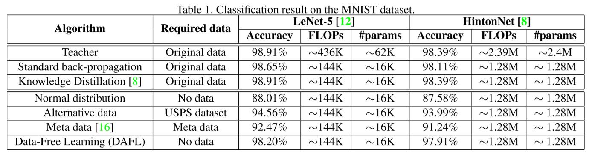

# 一、工作总结与规划

## 1、工作进度

+ 使用无标签训练数据，在MNIST数据集上，简单验证了知识蒸馏对模型压缩的效果：

  [Data-Free Learning of Student Networks](https://arxiv.org/abs/1904.01186) - ICCV 2019
  **论文中的效果**

  

  

  **teacher train**
  
  ```text
  Train - Epoch 1, Batch: 1, Loss: 2.297301
  Test Avg. Loss: 0.000191, Accuracy: 0.970800
  Train - Epoch 2, Batch: 1, Loss: 0.083168
  Test Avg. Loss: 0.000126, Accuracy: 0.979500
  Train - Epoch 3, Batch: 1, Loss: 0.053707
  Test Avg. Loss: 0.000100, Accuracy: 0.983700
  Train - Epoch 4, Batch: 1, Loss: 0.035690
  Test Avg. Loss: 0.000077, Accuracy: 0.988300
  Train - Epoch 5, Batch: 1, Loss: 0.010872
  Test Avg. Loss: 0.000101, Accuracy: 0.985000
  Train - Epoch 6, Batch: 1, Loss: 0.059809
  Test Avg. Loss: 0.000080, Accuracy: 0.987800
  Train - Epoch 7, Batch: 1, Loss: 0.019303
  Test Avg. Loss: 0.000062, Accuracy: 0.990800
  Train - Epoch 8, Batch: 1, Loss: 0.002754
  Test Avg. Loss: 0.000096, Accuracy: 0.986300
  Train - Epoch 9, Batch: 1, Loss: 0.065059
  Test Avg. Loss: 0.000080, Accuracy: 0.988500
  ```

  

  **student train**
  
  ```text
  [Epoch 191/200] [loss_oh: 2.008679] [loss_ie: -0.994435] [loss_a: -0.038867] [loss_kd: 0.000000]
  Test Avg. Loss: 0.014362, Accuracy: 0.857600
  [Epoch 192/200] [loss_oh: 2.008679] [loss_ie: -0.994435] [loss_a: -0.038867] [loss_kd: 0.000000]
  Test Avg. Loss: 0.014362, Accuracy: 0.857600
  [Epoch 193/200] [loss_oh: 2.008679] [loss_ie: -0.994435] [loss_a: -0.038867] [loss_kd: 0.000000]
  Test Avg. Loss: 0.014362, Accuracy: 0.857600
  [Epoch 194/200] [loss_oh: 2.008679] [loss_ie: -0.994435] [loss_a: -0.038867] [loss_kd: 0.000000]
  Test Avg. Loss: 0.014362, Accuracy: 0.857600
  [Epoch 195/200] [loss_oh: 2.008679] [loss_ie: -0.994435] [loss_a: -0.038867] [loss_kd: 0.000000]
  Test Avg. Loss: 0.014362, Accuracy: 0.857600
  [Epoch 196/200] [loss_oh: 2.008679] [loss_ie: -0.994435] [loss_a: -0.038867] [loss_kd: 0.000000]
  Test Avg. Loss: 0.014362, Accuracy: 0.857600
  [Epoch 197/200] [loss_oh: 2.008679] [loss_ie: -0.994435] [loss_a: -0.038867] [loss_kd: -0.000000]
  Test Avg. Loss: 0.014362, Accuracy: 0.857600
  [Epoch 198/200] [loss_oh: 2.008679] [loss_ie: -0.994435] [loss_a: -0.038867] [loss_kd: -0.000000]
  Test Avg. Loss: 0.014362, Accuracy: 0.857600
  [Epoch 199/200] [loss_oh: 2.008679] [loss_ie: -0.994435] [loss_a: -0.038867] [loss_kd: 0.000000]
  Test Avg. Loss: 0.014362, Accuracy: 0.857600
  ```

  

  **实验结果**
  
  | 实验  | Teacher模型大小 | Student 模型大小 | Teacher Epoch | Student Epoch | 压缩率 | Teacher Accuracy | Student Accuracy |
  | ----- | --------------- | ---------------- | ------------- | ------------- | ------ | ---------------- | ---------------- |
  | 实验1 | 247KB           | 68KB             | 10            | 200           | 3.6倍  | 0.988500         | 0.857600         |
  | 实验2 | 247KB           | 68K              | 20            | 300           | 3.6倍  | 0.986800         | 0.804200         |
  |       |                 |                  |               |               |        |                  |                  |

  

  **总结**

  + 训练Teacher网络需要标注数据；

  + 训练Student网络，训练阶段使用GAN生成的数据训练模型，即不需要带标签数据，测试阶段需要带标签的测试集；

  + Teacher网络收敛较快，训练时间较短；

  + Student网络收敛较慢，训练时间较长；

  + Student网络，在训练第106个epoch开始收敛，之后训练的精度无法进一步提升，模型精度低于0.9，精度损失较大，不适合产品落地；

    

  **精度损失较大的原因**
  
  + 主要原因，与Student网络有关，==根据不同的任务（分类、目标检测、分割等），需要精心设计合适的网络结构==；
  + 与GPU显卡有关，实验环境使用的GPU显存过小（GTX 1050Ti，4GB），batch_size设置较小，模型训练一次的数据较少，导致模型很难收敛；

## 2、接下来的工作安排

+ 搭建量化策略的开发环境，搭建TensorRT开发环境，实验验证量化策略；
+ 安排前端工程师介入，开始客户端页面开发；


# 二、待确认问题

1. 经过实验验证，发现知识蒸馏存在的问题：

   + ==Student网络训练时间较长，消耗GPU资源==；
   + 训练数据的支持：训练阶段不需要带标签的数据，==但是测试阶段需要test数据集==；
   + ==Student网络结构不确定性==：
   
   
   
   Student网络结构不确定性，解决办法：
   
   + 根据用户提供的pb或者ckpt等模型文件，解析Teacher网络。根据Teacher网络结构的特性，设计一种自动化生成Student网络的算法，生成对应的Student网络；
   + 根据不同的任务，比如分类、目标检测、图像分割等，自动选择对应的Student网络（工具箱提供Model ZOO）；
   
   
   
   总结：
   
   知识蒸馏策略，不太符合项目要求，且技巧性较强，研发的不确定性，考虑到项目的开发难度和产品落地化，团队讨论建议有两种方案：
   
   + 暂不考虑知识蒸馏策略，优先开发量化和剪枝策略；
   + 寻找其他鲁棒性强、通用性好的策略；
